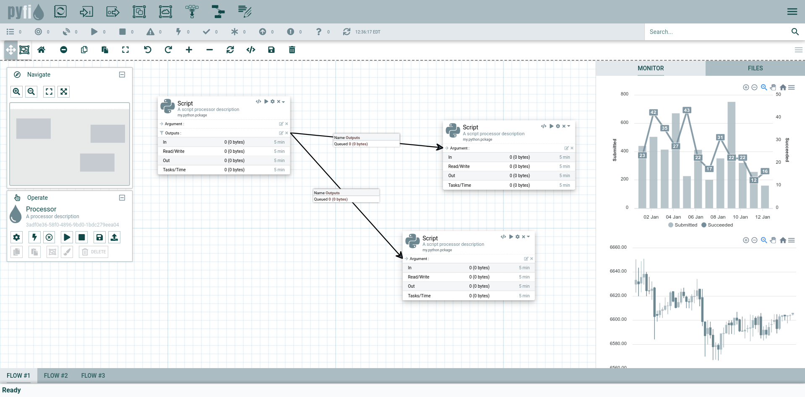
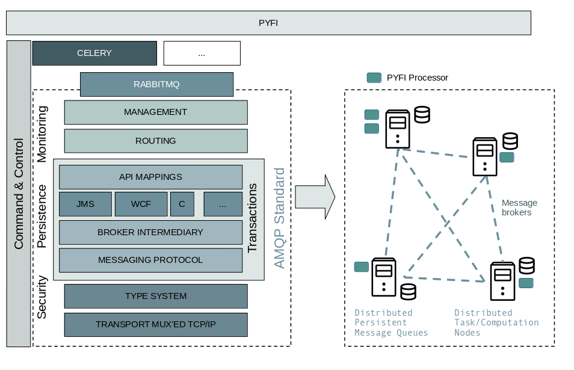
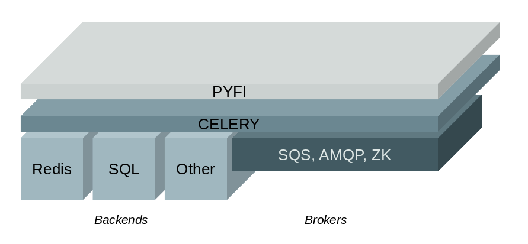
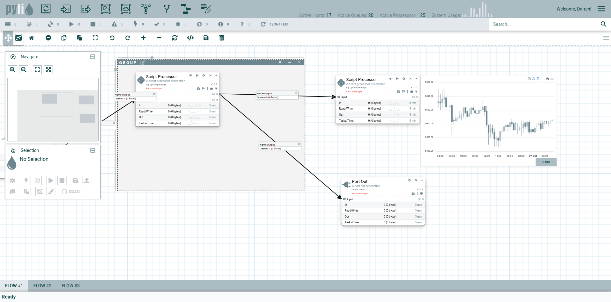
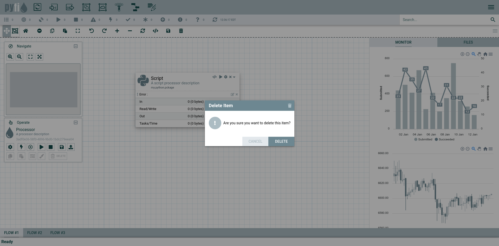
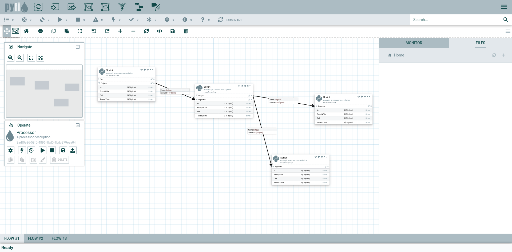
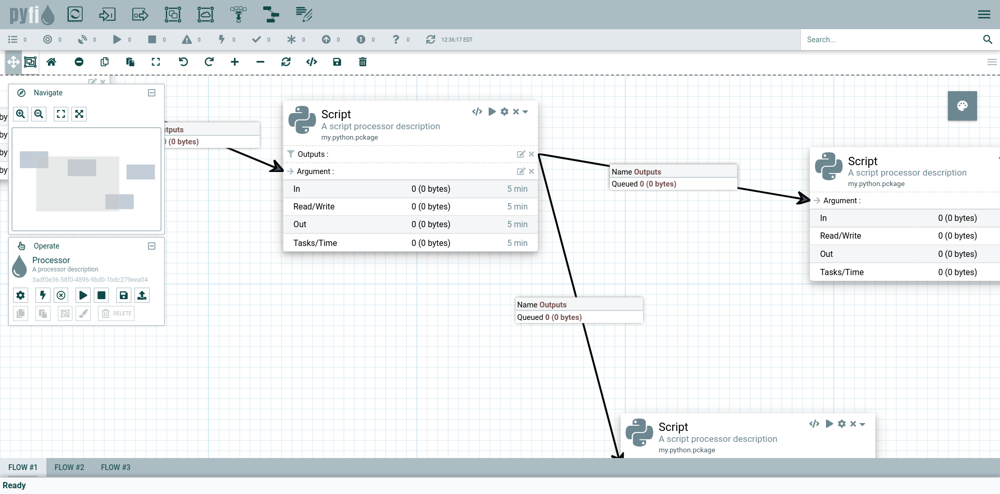
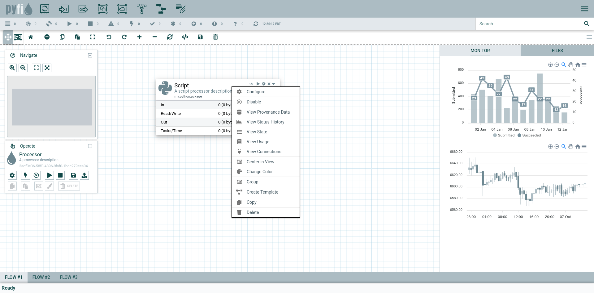

NodeJS/Vue UI for PYFI

PYFI will be a fully distributed open and extensible platform for building Nifi-like computation and data orchestration networks on top of a transactional & reliable enterprise message broker technology. In addition, it will have persistence of network data metrics and computational results in enterprise data (e.g. SQL) warehouse.

The architecture for PYFI is illustrated below, but one of the key themes in PYFI vs Nifi is PYFI's separation of underlying messaging & persistent queues from the UI. In PYFI processors are queue data consumers that scale distributively across a network - as first class citizens. This prevents them from cannibalizing resources in a VM where they would otherwise be mutexed against other processors (such as in Nifi). This will lead to greater performance and reliability.

Another key theme in PYFI will be the dynamic scripting of processors and full transparency of processor behaviors. Making this a runtime feature means you don't have to endure complex and lengthy modifications to low-level source code, builds and redeploys. In an enterprise that cycle can be frought with hurdles and approvals that prevent needed changes from coming quickly. PYFI avoids all that by creating a highly observable compute platform that doesn't compromise on security or features.

To run:

$ python -m http.server 8000

Then point your browser to http://localhost:8000

